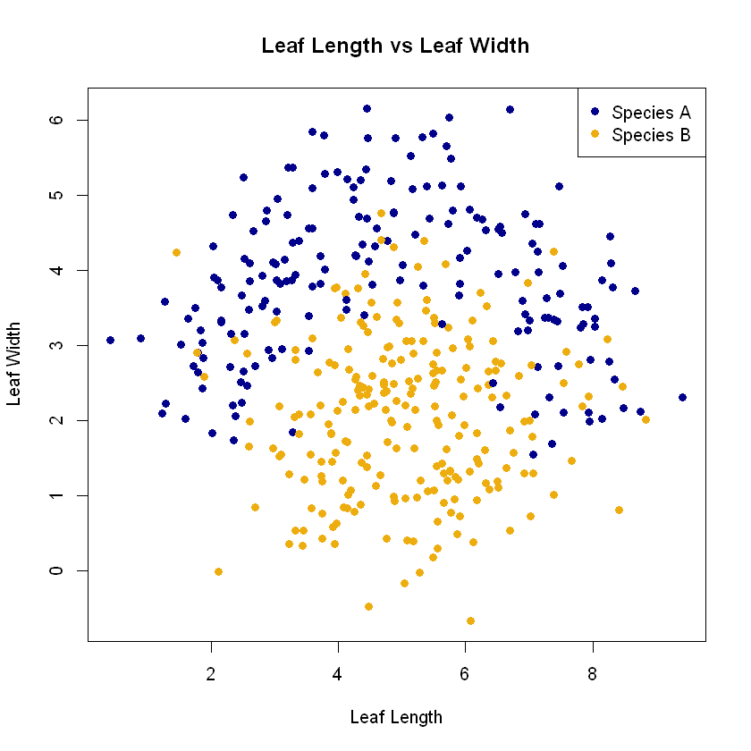
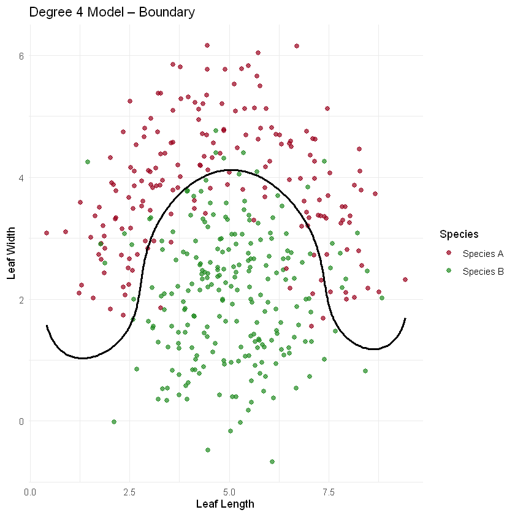
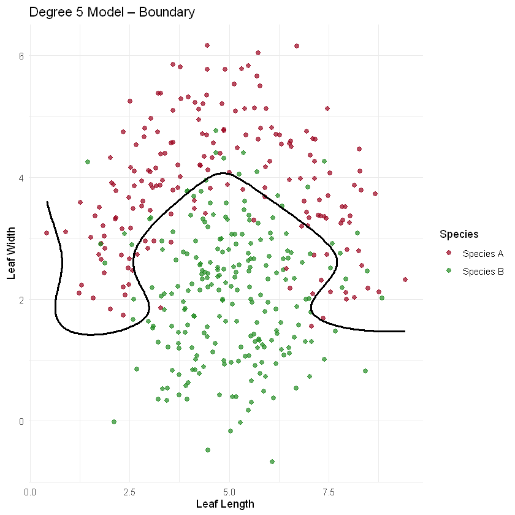
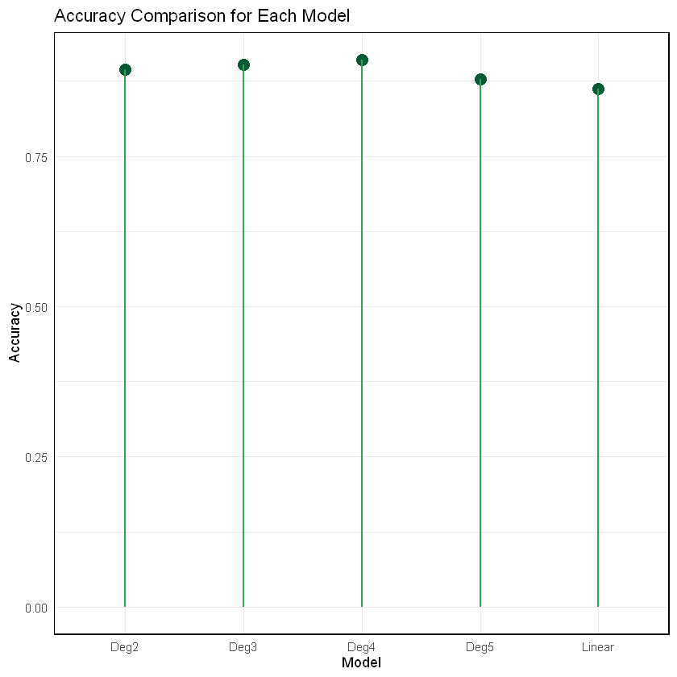
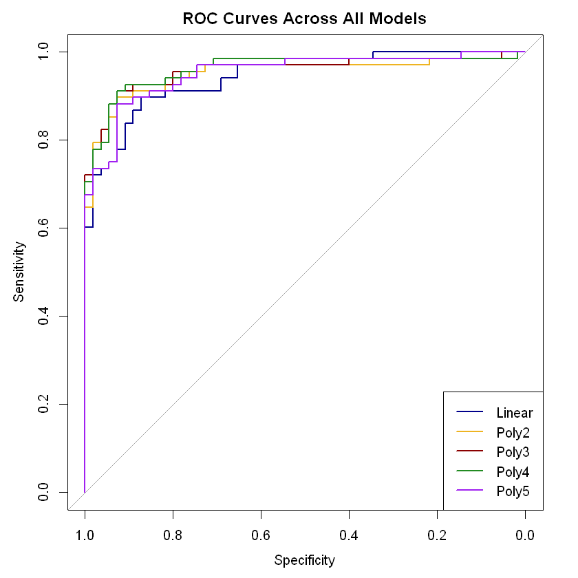

# Leaf Species Classification with Logistic Regression

This repository contains my university Statistical Data Science coursework on classifying two leaf species using leaf length and leaf width.

I compared a standard logistic regression model with polynomial logistic regression models of degree 2 to degree 5. The aim was to see how increasing model complexity changed both classification performance and the shape of the decision boundary.

## What I did

The analysis includes:

- cleaning and preparing the leaf measurement data
- exploring the relationship between leaf length, leaf width and species
- creating a 70/30 train and test split
- fitting a linear logistic regression model
- fitting polynomial logistic regression models from degree 2 to degree 5
- evaluating the models using accuracy, Kappa, sensitivity and specificity
- comparing decision boundaries
- plotting ROC curves
- checking how model complexity affected overfitting

## Main result

The degree 4 polynomial logistic regression model gave the strongest test performance.

| Model | Accuracy |
|---|---:|
| Linear | 86.18% |
| Degree 2 | 89.43% |
| Degree 3 | 90.24% |
| Degree 4 | **91.06%** |
| Degree 5 | 87.80% |

The results showed that adding some non-linearity improved classification, but the degree 5 model became too flexible and performed worse on the test data.

## Technologies used

- R
- Jupyter Notebook
- Logistic Regression
- Polynomial Logistic Regression
- ggplot2
- caret
- pROC
- patchwork

## Project structure

```text
leaf-species-logistic-regression/
├── notebooks/
│   └── leaf_species_analysis.ipynb
├── data/
│   └── leaf_data.csv
├── docs/
│   └── images/
│       ├── leaf-length-width-scatter.png
│       ├── linear-decision-boundary.png
│       ├── degree4-decision-boundary.png
│       ├── degree5-decision-boundary.png
│       ├── leaf-density-plots.png
│       ├── model-accuracy-comparison.png
│       ├── model-performance-metrics.png
│       └── roc-curves.png
├── .gitignore
├── LICENSE
└── README.md
```

## Example outputs

### Leaf measurements



### Degree 4 decision boundary



### Degree 5 decision boundary



### Accuracy comparison



### ROC curves



## Running the notebook

The notebook uses R and expects the dataset to be available as:

```text
leaf_data.csv
```

Place the CSV file inside the working directory used by the notebook, or update the `read.csv()` path before running it.

The main packages used are:

```r
library(ggplot2)
library(caret)
library(pROC)
library(patchwork)
```

## What I learned

This coursework helped me understand how model complexity affects classification. The linear model was useful as a baseline, but it could not fully capture the curved separation between the two species.

The polynomial models improved the fit up to degree 4. Degree 5 then lost performance on the test set, which showed how adding extra complexity can lead to overfitting rather than better generalisation.

I also found the decision boundary plots useful because they made the difference between underfitting, a good fit and overfitting much easier to see than using accuracy alone.

## Data

The original notebook reads from `leaf_data.csv`. The dataset was not present in the files I still had when preparing this repository, so it is not included here.

## License

This project is licensed under the MIT License.
